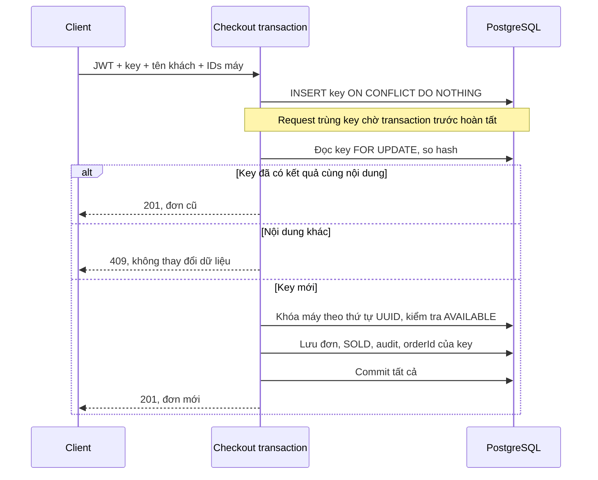

# Bước 2 — API vận hành và tư duy thiết kế

Nghiệm thu local ngày 2026-09-25: **21 unit tests + 71 integration tests = 92 PASS**,
không failure/error/skipped (đã bật `REFURBISHED_RUN_POSTMAN=true`). Trong đó Newman chạy
**17 requests, 23 assertions, 0 failures** trên PostgreSQL `refurbished_test`.
Log local: `.run/operations-final.log` (unit tests; lần package đầu vướng khóa JAR),
`.run/operations-full-it.log` (toàn bộ integration), `.run/operations-package.log` (đóng gói lại).
Các log nằm trong thư mục gitignored. Không thử ghi dữ liệu nghiệp vụ trên database dev.

`OperationsIT` kiểm tra filter thời gian/serial/phân trang, quyền audit, actor,
rollback, replay, key khác nội dung/khác actor và hai request bị chặn đồng thời trong PostgreSQL.
`PostmanCollectionIT` thực thi collection thật bằng Newman rồi dọn fixture riêng.
Ngoài ra đã sửa khác biệt độ chính xác timestamp và giữ hợp đồng validation khi thêm header.

## Hợp đồng API

| API | Quyền | Hành vi |
|---|---|---|
| `GET /api/orders` | ADMIN/STAFF | `customerName`, `from`, `to`, `page`, `size` |
| `GET /api/device-units` | ADMIN/STAFF | Thêm `serialNumber`, kết hợp `productId`/`status` |
| `GET /api/audit-events` | ADMIN | `actorId`, `action`, `targetType`, `targetId`, `from`, `to`, `page`, `size` |
| `POST /api/orders/checkout` | ADMIN/STAFF | Header tùy chọn `Idempotency-Key` |

Danh sách trả `{items,page,size,totalElements,totalPages}`. Page bắt đầu từ 0, size 1–100.
Đơn/audit sắp xếp thời gian giảm dần rồi UUID giảm dần để ổn định khi trùng thời gian.
Offset pagination có thể dịch trang khi có dữ liệu mới; chưa phải snapshot/cursor pagination.
Danh sách đơn chỉ có summary, lấy items qua `GET /api/orders/{id}` để tránh tải mọi thiết bị
của mọi đơn. Tên khách tìm chuỗi con không phân biệt hoa/thường, `%`, `_`, `!` là ký tự thật;
không bỏ dấu tiếng Việt. Serial so khớp chính xác sau trim/uppercase, chuỗi rỗng không khớp máy nào.

`from`/`to` dùng ISO-8601, ví dụ `2026-09-25T00:00:00Z`; khoảng `[from,to)` bao gồm đầu,
không bao gồm cuối. Có thể bỏ một trong hai, nhưng nếu cùng có thì phải `from < to`.
Nhờ vậy các khoảng ngày liên tiếp không đếm trùng giao dịch tại nửa đêm.
Thời gian đơn mới được chuẩn hóa microsecond trước khi lưu để response khớp PostgreSQL.

## Audit gắn với giao dịch

Migration V7 thêm `audit_events` và `checkout_requests`. Không sửa migration đã có.
Audit ghi UUID người thao tác từ JWT; bootstrap/recovery dùng `LOCAL_OPERATOR` và actor null;
các thao tác nội bộ không có JWT dùng `SYSTEM`. Không giả mạo người dùng đang được khôi phục.

Sự kiện hiện có: PRODUCT_CREATED, PRODUCT_UPDATED, DEVICE_RECEIVED, INSPECTION_STARTED,
INSPECTION_COMPLETED, DEVICE_SOLD, ORDER_CHECKED_OUT, WARRANTY_ISSUED, USER_CREATED,
PASSWORD_CHANGED, SESSIONS_REVOKED, ADMIN_BOOTSTRAPPED, ADMIN_RECOVERED.
Bảo hành được ghi trên target DEVICE_UNIT với warrantyId trong details, nên tra lịch sử serial
sẽ thấy toàn bộ vòng đời máy. Audit chỉ ghi hành động và chi tiết đã chọn, chưa phải diff đầy đủ
của mọi trường trước/sau. Không ghi password, hash mật khẩu, JWT hoặc toàn bộ request DTO.

`MANDATORY` buộc service audit tham gia transaction nghiệp vụ: không thể commit đơn mà mất
audit, cũng không để lại sự kiện bán thành công nếu bán rollback. Sự kiện đăng nhập thất bại
và truy cập bị chặn cần hệ thống security log riêng, chưa nằm trong audit nghiệp vụ này.
Actor/target là snapshot không có FK đến bảng đa loại, lịch sử còn tồn tại khi đối tượng bị xóa.
Không có HTTP API sửa/xóa audit; đây chưa phải kho log chống sửa bởi quản trị database.

## Chống đơn trùng khi retry

Key dài 1–128 ký tự `[A-Za-z0-9._:-]`, phân biệt hoa/thường và thuộc phạm vi một actor UUID.
Khi gửi key phải có Bearer JWT, kể cả môi trường test đang bật bypass quyền.
Client cũ không gửi key vẫn dùng quy tắc khóa máy hiện có.

Hash từ tên khách đã trim và IDs máy đã sắp xếp. Đảo thứ tự máy không tạo request mới;
máy lặp trong cùng request vẫn bị từ chối. UUID được sắp xếp trước khi khóa để giảm deadlock.
Không bắt unique violation để tiếp tục dùng transaction PostgreSQL đã lỗi; dùng ON CONFLICT
để DB tự đồng bộ hai request. Nếu nghiệp vụ thất bại, rollback cả key và cho phép retry sau sửa lỗi.
Hiện chỉ lưu kết quả thành công, không tự hết hạn/xóa key. Sau này có sửa/hủy đơn cần đánh giá
lại replay: hiện đơn hoàn tất bất biến, replay dựng response từ đơn và sắp xếp items ổn định.

## Sử dụng và giới hạn

- [Collection Postman và hướng dẫn](../postman/README.md).
- [Swagger](SWAGGER.md) có các endpoint/filter/header mới khi chạy bản build mới.
- V7 được kiểm tra trên database test; database dev chỉ migrate khi bạn khởi động bản mới.
- Chưa bao gồm UI quản trị Java (bước 3), CI/backup/deployment (bước 4), hay bán online (bước 5).
- Chưa benchmark dữ liệu lớn hoặc thiết lập retention cho audit/idempotency; các việc này
  thuộc nghiệm thu vận hành, không được suy ra từ integration test local.
