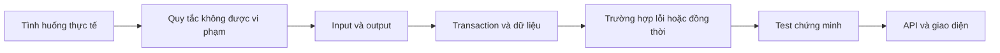
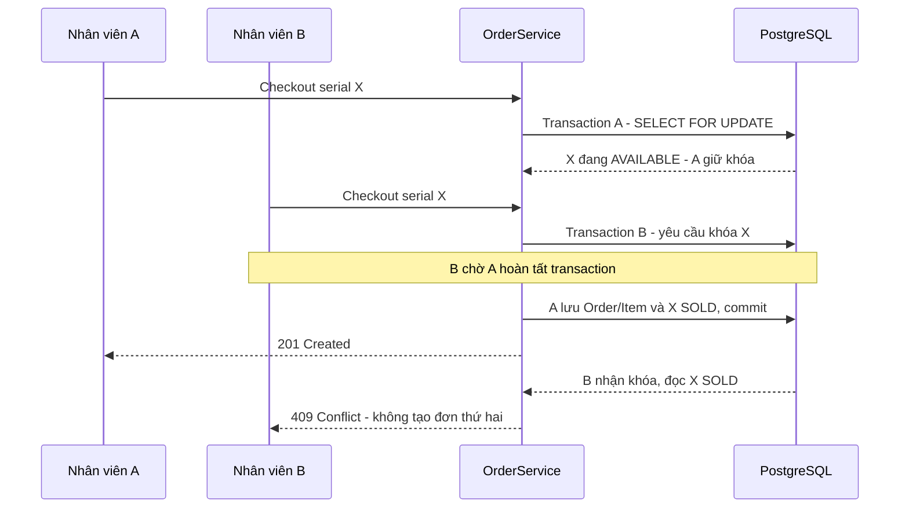
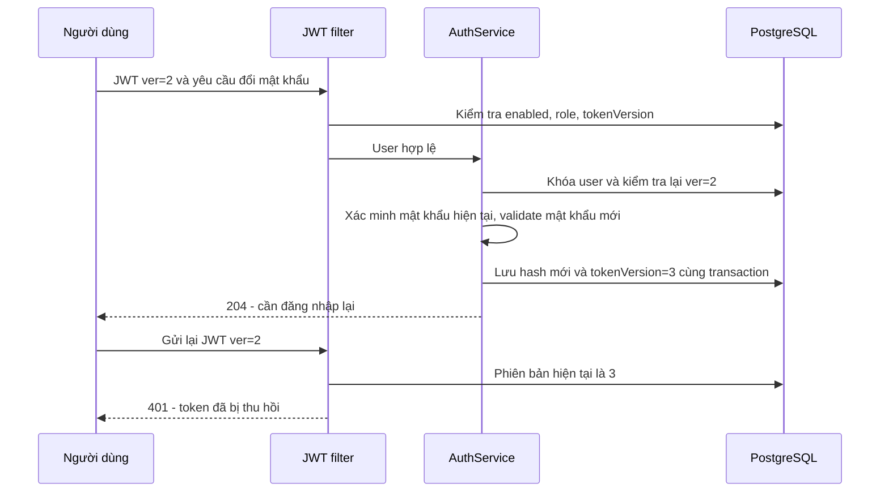
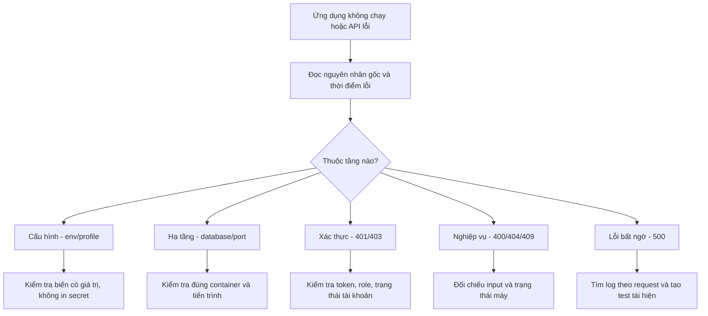

# Logic, tư duy nghiệp vụ và tư duy giải quyết vấn đề

[Mục lục](README.md) · [Dữ liệu](DATA-MODEL.md)

## 1. Cách đi từ yêu cầu đến code



Ví dụ “bán máy”: không bắt đầu bằng viết controller. Đầu tiên xác định máy nào được
bán, có bán một phần đơn không, giá lấy từ đâu, ai có quyền và hai người cùng bán thì sao.

## 2. Phân trách nhiệm theo tầng

| Tầng | Trách nhiệm | Ví dụ |
|---|---|---|
| DTO/validation | Hình dạng dữ liệu đầu vào | Danh sách không rỗng, pin 0–100 |
| Security | Danh tính/quyền được phép gọi | STAFF không được tạo Product |
| Controller | HTTP, status code, chuyển DTO | POST checkout trả 201 |
| Service | Điều phối nhiều entity và transaction | Khóa tất cả máy rồi kiểm tra |
| Entity | Quy tắc của chính đối tượng | Chỉ INSPECTING mới hoàn tất kiểm định |
| Repository | Đọc/ghi và khóa theo truy vấn | findByIdForUpdate |
| Database | Ràng buộc cuối cùng | Serial unique, item không bán trùng máy |
| Frontend | Hướng dẫn thao tác và phản hồi | Hiện lỗi 409 và cập nhật danh sách |

Validation ở form giúp nhập thuận tiện; nó không thay validation/backend constraints.

## 3. Chống hai người bán cùng máy — HIỆN CÓ



**Vì sao không chỉ kiểm tra status rồi save?** Hai request có thể cùng đọc AVAILABLE
trước khi request nào ghi SOLD. Row lock làm việc kiểm tra và chuyển trạng thái được
tuần tự hóa trên cùng máy. Unique constraint là lớp bảo vệ bổ sung.

Với nhiều máy, khóa theo UUID đã sắp xếp giúp giảm nguy cơ deadlock. Nó không phải
bằng chứng rằng toàn hệ thống không thể deadlock; vẫn cần timeout và test tải.

## 4. Transaction và lỗi mạng khác nhau

| Tình huống | Hành vi đúng |
|---|---|
| Một máy chưa AVAILABLE | Từ chối cả đơn, các máy khác không bị bán |
| Database lỗi trước commit | Rollback thay đổi trong transaction |
| Server đã commit nhưng client mất mạng | Đơn có thể đã tồn tại; không kết luận bán thất bại |
| Client gửi lại yêu cầu vừa mất response | ĐÃ CÓ: cùng actor/key/nội dung trả lại đơn cũ; khác nội dung trả 409 |

Idempotency giải quyết sự không chắc chắn khi retry. Nó khác với row locking:
row locking chống hai giao dịch bán cùng máy; idempotency giúp nhận lại kết quả của
cùng một yêu cầu mà không biến nó thành yêu cầu mới.

## 5. Đổi mật khẩu và thu hồi phiên — ĐANG LÀM



**Tư duy nghiệp vụ:** thay mật khẩu nhưng giữ nguyên token bị lộ thì chưa giải quyết
được nhu cầu bảo vệ tài khoản. Logout-all phải có tác dụng phía server.

**Giới hạn cần nói rõ:** kiểm tra token ở đầu request không tự hủy request đã qua
kiểm tra và đang thực thi. Các thao tác nhạy cảm cần xác định có phải kiểm tra lại
dưới transaction hay không. Không mô tả cơ chế này là hủy tức thì mọi tác vụ đang chạy.

## 6. Quản lý ADMIN cuối cùng — KẾ HOẠCH

Invariant: luôn còn ít nhất một ADMIN hoạt động sau thao tác khóa/hạ quyền.
Hai ADMIN cùng hạ quyền nhau có thể phá invariant nếu chỉ dùng `count > 1` trước save.
Cần chọn cơ chế đồng bộ ở database cho toàn bộ thao tác thay đổi quyền ADMIN, rồi test
hai transaction cạnh tranh. Khóa riêng từng user chưa chắc bảo vệ được invariant này.

Không tự mở lại tài khoản disabled trong recovery: việc bị khóa có thể là quyết định
nghiệp vụ, khác với việc quên mật khẩu.

## 7. Bảo hành và ngày tháng

Thời hạn theo tháng là lịch, không phải luôn bằng `30 × số tháng` ngày. Code hiện tính
`startsOn.plusMonths(durationMonths)` và ngày cấp theo UTC. Cần chốt ngày hết hạn có
bao gồm ngày cuối hay không trước khi xây API xác nhận còn bảo hành.

Warranty chỉ là cam kết thời hạn. WarrantyClaim là từng lần khách yêu cầu xử lý;
hai khái niệm này cần tách để một bảo hành có thể có nhiều lần tiếp nhận.

## 8. Cách debug có hệ thống



Các lỗi đã gặp trong dự án:

- Thiếu password DB: nạp env trong cùng terminal, không tạo lại database.
- Port 8080 bận: dùng bản backend đang chạy hoặc dừng đúng tiến trình/đổi port.
- Bootstrap password không hợp lệ: sửa biến bootstrap, không sửa DeviceUnit.
- Có dòng Started rồi shutdown: đọc tiếp log của startup runners trước khi kết luận thành công.

## 9. Comment được mong đợi trong code

```java
// Nghiệp vụ: khách chọn nhiều máy như một đơn duy nhất; không tự bán một phần.
// Giải pháp: kiểm tra toàn bộ máy dưới khóa trước khi thay trạng thái bất kỳ máy nào.
```

Comment nên trả lời: quy tắc nào đang được bảo vệ, vì sao đặt transaction/lock ở đây,
và trường hợp biên nào dễ bị bỏ sót. Test cung cấp bằng chứng cho comment đó.
