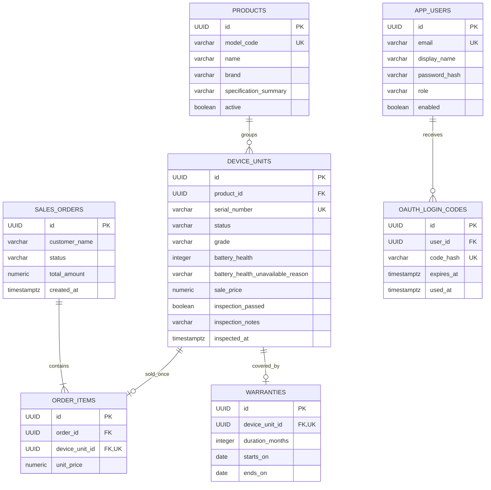
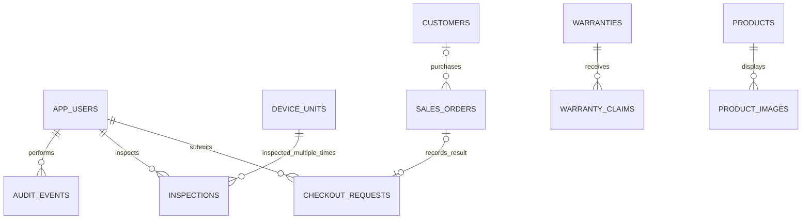
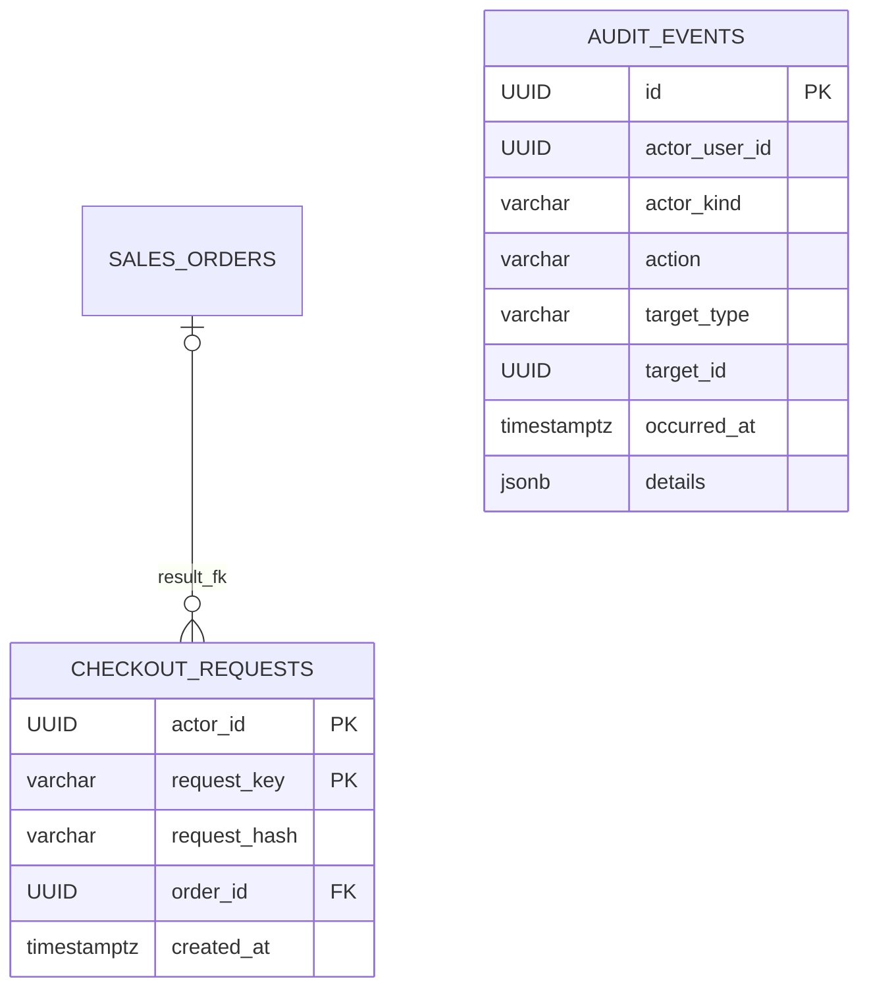

# Sơ đồ dữ liệu và định hướng mở rộng

[Mục lục](README.md) · [Workflow](WORKFLOW.md)

## 1. ERD hiện có — migrations V1–V5

Sơ đồ liệt kê trường chính, không thay thế toàn bộ DDL. Tham chiếu chính xác:
[migrations](../../backend-java/src/main/resources/db/migration/).

Quan hệ một đơn có ít nhất một item là yêu cầu của luồng checkout. FK trong SQL chỉ
bảo vệ hướng item → order, không tự đảm bảo một row order luôn có ít nhất một item.

## 2. Ý nghĩa và bất biến

| Dữ liệu | Ý nghĩa nghiệp vụ | Cách bảo vệ hiện có |
|---|---|---|
| Product | Một model/cấu hình chung | model_code unique, validation |
| DeviceUnit | Một máy vật lý | serial unique, FK Product, state machine |
| Order | Một lần chốt bán | transaction, trạng thái hiện chỉ COMPLETED |
| OrderItem | Máy cụ thể và giá đã bán | FK, unique device_unit_id, snapshot giá |
| Warranty | Thời hạn bảo hành của đúng máy | unique device_unit_id, thời hạn được kiểm tra |
| AppUser | Nhân viên được cấp quyền | email unique, BCrypt, ADMIN/STAFF |
| OAuthLoginCode | Vé đổi JWT dùng một lần | chỉ lưu hash, thời hạn và row lock |

Các điều kiện quan hệ như “chỉ cấp bảo hành cho máy SOLD” do service kiểm tra dưới
transaction/lock; không nên hiểu rằng mọi quy tắc đều đã được một SQL CHECK bảo vệ.

Hiện chưa có FK từ Order/DeviceUnit/Warranty đến nhân viên đã thực hiện thao tác.
Tên khách trong Order là chuỗi, chưa có bảng Customer. Inspection hiện nằm ngay trên
DeviceUnit, chưa có bảng lưu nhiều lần kiểm định.

## 3. Thay đổi V6 — ĐÃ KIỂM THỬ LOCAL

| Bảng | Trường thêm | Lý do |
|---|---|---|
| app_users | token_version | Đổi mật khẩu/logout-all làm JWT cũ hết hiệu lực |
| oauth_login_codes | token_version | Không cho code cũ tạo phiên mới sau thu hồi |

JWT mang claim `ver`; đây là dữ liệu trong token, không phải một bảng JWT trong DB.
Các token cũ thiếu `ver` sẽ cần đăng nhập lại sau khi nâng cấp. Code cũ được migration
đánh dấu không khớp phiên bản. Cần test việc nâng cấp trước khi dùng bản mới.

## 4. Mô hình mở rộng — KẾ HOẠCH, chưa có migration

Sơ đồ mở rộng giữ các ý tưởng ban đầu; riêng audit_events/checkout_requests đã có V7.
Quan hệ actor là quan hệ logic, không có FK đến app_users. Schema thực tế bổ sung:

order_id được phép null trong transaction đang xử lý; service điền kết quả trước commit.
Audit giữ actor/target như snapshot, không có FK đa hình. Các bảng còn lại vẫn là đề xuất.

| Bảng đề xuất | Nội dung dự kiến | Quyết định cần chốt |
|---|---|---|
| audit_events (đã có V7) | actor, action, target type/id, thời gian, chi tiết allowlist; ADMIN đọc | Thời hạn lưu, kho log chống sửa thuộc vận hành |
| inspections | device, nhân viên, kết quả, bằng chứng, thời điểm | Khi nào cho tái kiểm định, lưu kết quả cũ thế nào |
| warranty_claims | warranty, lỗi, trạng thái xử lý, bàn giao | Điều kiện chấp nhận và quy trình sửa/đổi |
| customers | tên và thông tin liên hệ tối thiểu | Khách vãng lai, trùng số điện thoại, quyền truy cập |
| product_images | product, storage key, thứ tự, mô tả | Nhà cung cấp lưu trữ và giới hạn upload |
| checkout_requests (đã có V7) | PK(actor_id, request_key), request_hash, order_id, created_at | Hiện giữ key không TTL; kết quả thành công commit cùng đơn |

Retention và kho audit độc lập vẫn thuộc kế hoạch vận hành.

## 5. Những thay đổi không được làm cơ học

- Không thêm `Product.quantity` để thay DeviceUnit: mất dấu máy cụ thể.
- Không sửa giá OrderItem khi thay giá niêm yết: sai lịch sử doanh thu.
- Không xóa user/thiết bị tùy ý khi đã có lịch sử tham chiếu.
- Không sửa migration V1–V5 đã áp dụng; thêm migration mới.
- Không bỏ unique `order_items.device_unit_id` chỉ để hỗ trợ bán lại máy đổi trả.
  Cần mô hình lần bán/hoàn trả và điều kiện hợp lệ trước khi nới constraint đó.
- Không thêm cột `payment_status` rồi coi checkout online đã hoàn tất: còn reservation,
  webhook, retry, hủy và hoàn tiền.
