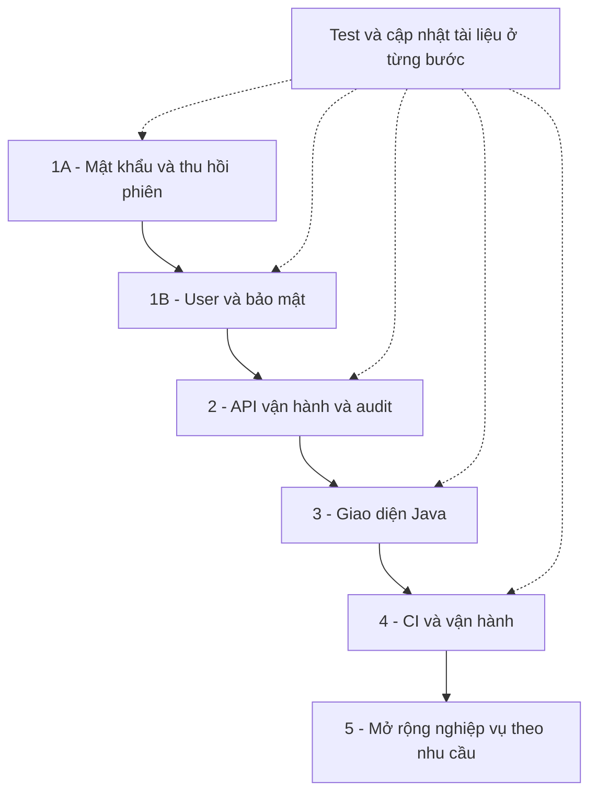
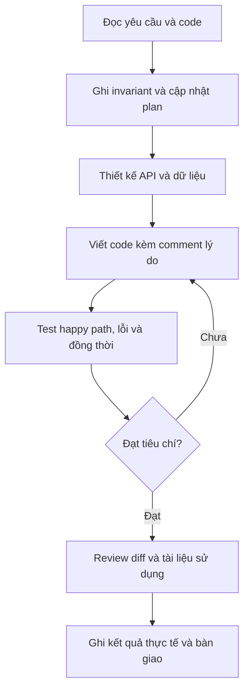

# Workflow triển khai, kiểm chứng và bàn giao

[Mục lục](README.md) · [Kế hoạch chi tiết](../../PLAN.md)

Cập nhật 2026-09-25: 1A, Swagger và bước 2 đã triển khai/kiểm thử local. Bước 2 được
ưu tiên với ADMIN/STAFF hiện có; 1B còn thiếu. Sơ đồ dưới là phụ thuộc thiết kế ban đầu,
không phải tất cả các ô đều đã hoàn thành. Xem [nghiệm thu bước 2](../../backend-java/docs/STEP-2-OPERATIONS.md).

## 1. Thứ tự phụ thuộc

CI là một hạng mục ở bước 4 nhưng kiểm thử local bắt buộc ngay từ bước 1; không chờ
làm CI mới kiểm thử. Không bỏ qua lỗi bước trước để tăng số lượng tính năng.

## 2. Đầu ra nhìn thấy được

| Bước | Người dùng sẽ làm được gì? | Bằng chứng nghiệm thu |
|---|---|---|
| 1A | Đổi mật khẩu, logout-all, khôi phục đúng ADMIN local | API tests, test recovery và hướng dẫn Postman |
| 1B | Quản lý nhân viên an toàn | Test quyền, ADMIN cuối cùng, session/OAuth |
| 2 | Tìm serial, tìm đơn, xem lịch sử thao tác | Test filter, pagination, audit và retry |
| 3 | Thao tác nhập → kiểm định → bán → bảo hành bằng UI | E2E với Java API thật |
| 4 | Phát hiện lỗi tự động, quan sát và phục hồi hệ thống | CI reports, metrics, restore drill |
| 5 | Các nghiệp vụ mở rộng đã được chọn | State machine, migration và test riêng |

## 3. Quy trình của một tính năng

Khi thay schema: migration mới phải giữ dữ liệu cũ theo chính sách được ghi rõ.
Không chỉnh migration đã áp dụng để ép một test pass.

## 4. Các lớp kiểm chứng

| Lớp | Câu hỏi cần trả lời |
|---|---|
| Unit | Quy tắc của một đối tượng/validator đúng ở các biên không? |
| Integration PostgreSQL | Transaction, FK, unique, khóa và rollback có thực sự hoạt động? |
| HTTP security | Người không có quyền có bị chặn trước thao tác dữ liệu? |
| Concurrency | Hai thao tác cùng lúc có làm sai invariant? |
| UI/E2E | Người dùng hoàn tất công việc với API thật và hiểu lỗi? |
| Vận hành | Khởi động, nâng cấp, sao lưu và khôi phục có làm được theo tài liệu? |

Test database phải là `refurbished_test`. Không dùng ADMIN thật để test reset password.
Không coi health UP là bằng chứng rằng mọi API và nghiệp vụ đã đúng.

## 5. Quyết định cần chốt trước phần phụ thuộc

- Product inactive có hiển thị công khai không?
- Bảo hành bắt đầu ngày bán, ngày giao hay ngày cấp? Ngày hết hạn được tính thế nào?
- Có khách vãng lai không và cần lưu tối thiểu dữ liệu khách nào?
- ADMIN có được tự hạ quyền/khóa chính mình khi còn ADMIN khác không?
- Có nhu cầu bán online hay chỉ vận hành tại quầy trong bản đầu?
- Khi triển khai: nền tảng, domain, ngân sách, mục tiêu downtime và mất dữ liệu chấp nhận được?

Các câu hỏi này không chặn việc hoàn thiện đổi mật khẩu hoặc API tra cứu. Chỉ chốt
trước khi làm tính năng phụ thuộc để tránh tự suy diễn chính sách cửa hàng.

## 6. Cách theo dõi tiến độ

`PLAN.md` là nơi cập nhật trạng thái và checklist nghiệm thu. Bộ tài liệu này giải thích
mô hình, không thay thế kết quả test. Mỗi đợt bàn giao ghi rõ:

- Đã thay đổi gì và giúp giải quyết công việc nào.
- File/API liên quan và cách sử dụng.
- Lệnh kiểm thử, kết quả, giới hạn chưa xác minh.
- Trạng thái migration, commit/push và bước tiếp theo.

Hiện bước 1A đã kiểm thử local với 85 tests PASS và test script. Bước 1B chưa triển khai đầy đủ. Bộ sơ đồ không hàm ý các phần KẾ HOẠCH
đã tồn tại trong ứng dụng. Chưa có cam kết lịch hoàn thành khi chưa đo phạm vi thực tế.
