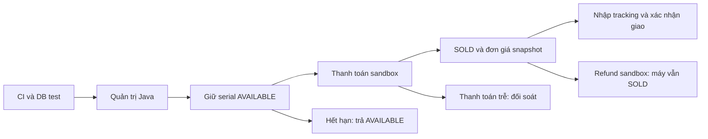

# Triển khai tiếp bước 4 → 3 → 5

Ngày bắt đầu: 2026-09-25.

## Kết quả nghiệm thu local — 2026-09-26

`mvn verify` đạt **23 unit tests + 85 integration/acceptance tests = 108 PASS**.
Newman chạy 17 request, 23 assertion, không failure. Browser acceptance chạy ADMIN/STAFF
với API Java/DB test thật: tạo model, nhập máy, kiểm định, checkout sau response bị mất,
bảo hành, audit, giao diện hẹp và logout-all. Restore drill PostgreSQL test vào container
cô lập PASS (V8, schema và số lượng dữ liệu được kiểm tra).

Đây là nghiệm thu local. Không phải bằng chứng GitHub Actions, staging/public deployment,
payment provider, webhook ký số, shipping provider, RPO/RTO hay payment/refund thật.

## Phạm vi được triển khai

1. Java CI dùng PostgreSQL test riêng, metrics/readiness có phân quyền, request ID,
   profile staging với guard riêng, Dockerfile/Compose và backup/restore vào đích cô lập.
2. Giao diện quản trị Java phục vụ API đã có: login, model, kho/kiểm định, bán tại quầy,
   đơn, bảo hành, tạo nhân viên và audit. Token chỉ nằm trong memory; API vẫn giữ quyền.
3. Nền tảng bán online: reservation có TTL, tranh chấp với bán tại quầy, xác nhận thanh
   toán sandbox, giao hàng nhập tracking, hoàn tiền sandbox và trạng thái đối soát.
   Provider live, hosting/domain và chính sách thương mại cần câu trả lời của chủ dự án;
   không đánh dấu đã thu/hoàn tiền thật khi chỉ chạy mô phỏng.

## Quyết định nghiệp vụ ban đầu

UI dùng module JavaScript thuần tại `static/admin`, phục vụ cùng origin với API Java.
Không cần một runtime Node ở deployment; `node --check` kiểm tra cú pháp và browser E2E
kiểm tra hành vi. Đây là thay đổi có chủ đích so với đề xuất workspace React riêng.

- Reservation được ADMIN/STAFF tạo cho khách, chưa mở guest endpoint hoặc đăng ký CUSTOMER.
  Đây là nền vận hành online; storefront công khai và định danh khách là phần chưa chốt.
- Mỗi reservation giữ một serial, TTL mặc định 15 phút. Giá snapshot từ database.
- Bán tại quầy và reservation cùng khóa device_units, chỉ AVAILABLE mới được giữ/bán.
- Xử lý hết hạn và payment cùng khóa reservation trước rồi khóa máy. Không giữ transaction
  khi gọi dịch vụ ngoài. Payment trễ chỉ ghi cần đối soát, không bán máy đã được giải phóng.
- Sandbox payment chỉ ADMIN, tắt mặc định và không được bật trong staging. Không có API
  công khai cho client tự tuyên bố đã trả tiền. Provider thật cần webhook có chữ ký riêng.
- Hoàn tiền không trả máy về AVAILABLE. Máy vẫn SOLD cho đến khi có quy trình nhận/trả
  và tái kiểm định; giữ nguyên unique order_items.device_unit_id.
- Giao hàng dùng tracking nhập thủ công; không gọi hãng vận chuyển khi chưa chọn provider.
- Bảo hành giữ chính sách cấp thủ công hiện hữu, chưa tự khởi tạo theo ngày giao hàng.

## Kiểm chứng và giới hạn bàn giao

- Unit/IT với PostgreSQL; test giữ máy đồng thời, expiry/payment, payment lặp/đến trễ,
  quyền truy cập, refund và checkout tại quầy không bán máy đã giữ.
- UI build và browser flow; các tình huống timeout/401/409 phải có thông báo phù hợp.
- Restore drill chỉ vào container riêng, không ghi đè dev/test.
- CI chưa được coi đã chạy trên GitHub nếu chưa có run thật; Docker staging local
  không đồng nghĩa production deployment. Ghi rõ phần chưa thể nghiệm thu.

