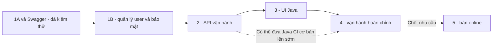

# Review bốn hạng mục nâng cấp tiếp theo

Ngày review: 2026-09-25. Phạm vi: code Java, hợp đồng frontend, migrations, workflows
và tài liệu trong workspace. Bảng bên dưới đã cập nhật sau triển khai bước 2.

## Kết luận từ code

| Hạng mục | Đã có | Chưa có | Kết luận |
|---|---|---|---|
| API vận hành | Danh sách đơn, tìm serial, audit, checkout idempotency, Swagger, Postman | Benchmark tải lớn/retention thuộc bước vận hành | Đã triển khai và kiểm thử local |
| Giao diện quản trị Java | React legacy có màn quản trị | Luồng end-to-end dùng hợp đồng Java | Chưa làm |
| Java CI/vận hành | PostgreSQL dev/test local, test Java, health SELECT 1 | Workflow Java, metrics Java, backup/restore runbook đã thử, deployment riêng | Chưa hoàn thành |
| Bán online Java | Bán đồng bộ, khóa thiết bị chống bán trùng | Reservation có TTL, payment, shipping, refund | Chưa làm; tùy nhu cầu |

## Bằng chứng

- [OrderController](../../backend-java/src/main/java/com/example/refurbished/order/OrderController.java)
  có POST checkout với Idempotency-Key, GET theo ID và GET danh sách có filter.
- [InventoryController](../../backend-java/src/main/java/com/example/refurbished/inventory/InventoryController.java)
  nhận filter productId/status/serialNumber/page/size.
- Migrations hiện V1–V7; V7 thêm audit và checkout_requests, chưa có thanh toán online.
- [Frontend apiClient](../../fe/src/services/apiClient.ts) mặc định gọi Node ở 8888;
  các luồng auth/cart/payment cũ chưa chuyển sang contract Java.
- [Backend CI hiện tại](../../.github/workflows/be-ci.yml) chạy Node trong be;
  [frontend CI](../../.github/workflows/fe-ci.yml) chạy frontend cũ.
- [Compose Java](../../backend-java/compose.local.yml) chỉ chứa hai database local.
- [HealthController](../../backend-java/src/main/java/com/example/refurbished/common/health/HealthController.java)
  kiểm tra DB, chưa phải metrics hay hệ thống cảnh báo.
- [OrderStatus](../../backend-java/src/main/java/com/example/refurbished/order/OrderStatus.java)
  hiện chỉ có COMPLETED. RESERVED trên DeviceUnit là bước trong transaction bán,
  chưa phải chức năng giữ chỗ online.

Postman đã được chạy bằng Newman: 17 request, 23 assertion, không lỗi trên DB test riêng.
Swagger/Postman không đồng nghĩa đã có frontend quản trị Java.
File backup và cấu hình Prometheus/production của Node cũ không được tính là khả năng
vận hành Java đã được kiểm chứng. 86 test PASS trước đó chứng minh phạm vi đã test,
không chứng minh các tính năng chưa triển khai trong bảng này. Nghiệm thu bước 2 được ghi
riêng tại [API vận hành](../../backend-java/docs/STEP-2-OPERATIONS.md).

## Kế hoạch chi tiết

1. [Bước 2 — API vận hành và Postman](PLAN-02-OPERATIONS-API.md)
2. [Bước 3 — Giao diện quản trị Java](PLAN-03-ADMIN-UI.md)
3. [Bước 4 — Java CI và vận hành](PLAN-04-JAVA-OPERATIONS.md)
4. [Bước 5 — Bán online tùy chọn](PLAN-05-ONLINE-SALES.md)

Giữ số bước theo [PLAN.md](../../PLAN.md), không đánh số lại thành 1–4 để tránh nhầm
với bước 1A đã hoàn thành và 1B còn thiếu. Bước 2 đã thực hiện; bước 3–5 vẫn là kế hoạch.

## Phụ thuộc và thứ tự

Không cần đợi UI hoàn thành mới chạy Java CI: có thể làm CI kiểm thử cơ bản sớm,
nhưng không gọi cả bước vận hành hoàn tất chỉ vì có một workflow build.
