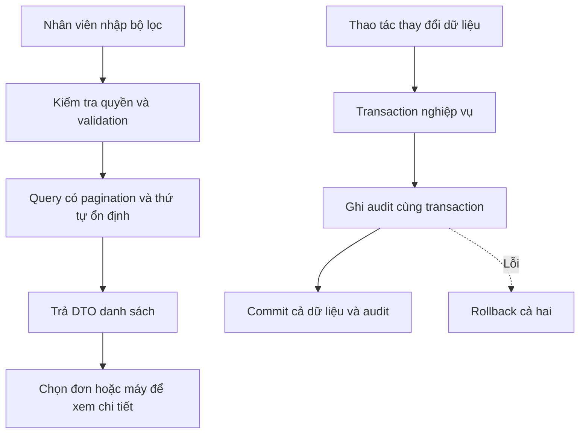
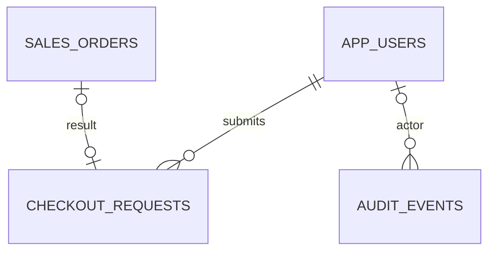

# Bước 2 — API vận hành, audit và collection Postman

Trạng thái: ĐÃ TRIỂN KHAI VÀ KIỂM THỬ LOCAL (2026-09-25), chưa commit/push.
[Hợp đồng và nghiệm thu](../../backend-java/docs/STEP-2-OPERATIONS.md).

## Quyết định triển khai đợt hiện tại

Theo yêu cầu mới, ưu tiên bước 2 bằng quyền ADMIN/STAFF hiện có; bước 1B vẫn còn việc,
không coi nó đã hoàn tất. Đợt này không sửa UI hoặc triển khai production.
Filter tên khách là tìm chuỗi con không phân biệt hoa thường, ký tự %/_ là ký tự thật;
serial là so khớp chính xác sau trim/uppercase. Khoảng thời gian [from,to) dùng Instant.
Audit chỉ ADMIN đọc, không ghi body tùy ý hoặc credentials. Audit không FK đến target
đa loại; actor ID được giữ như snapshot kể cả khi tài khoản về sau bị xóa.
Idempotency-Key checkout tùy chọn để tương thích client cũ, bắt buộc có JWT khi gửi key;
scope theo actor, không tự xóa khóa; chỉ lưu kết quả thành công cùng transaction bán.
Retry cùng tên khách đã trim và cùng tập ID máy được coi là cùng request, không phụ thuộc
thứ tự ID. Lỗi nghiệp vụ rollback cả khóa, không cache lỗi. Replay trả lại 201 và đơn cũ.

## 1. Mục tiêu nghiệp vụ

Nhân viên tìm được máy bằng serial, tìm lại đơn theo khách/ngày và biết ai đã thực hiện
thao tác. Người phát triển chạy được một chuỗi request có kiểm tra kết quả mà không
chép ID thủ công sau mỗi lần gọi.

Ví dụ: khách mang máy MBA001 đến bảo hành. Nhân viên tìm serial → lấy device ID → tra
bảo hành, đối chiếu lịch sử bán/kiểm định nếu có quyền, thay vì tìm UUID trong SQLTools.

## 2. API đề xuất

| Endpoint | Quyền dự kiến | Hành vi |
|---|---|---|
| GET /api/orders | ADMIN/STAFF | page/size, customerName, from/to, order theo createdAt + id |
| GET /api/device-units?serialNumber=... | ADMIN/STAFF | Lọc serial chính xác, normalize như lúc nhập |
| GET /api/audit-events | ADMIN mặc định | Lọc actor/action/target/time, phân trang |
| POST /api/orders/checkout | ADMIN/STAFF | Bổ sung idempotency theo hợp đồng được chốt |

Các endpoint đã có trong source và Swagger; cần chạy bản build mới để sử dụng.
Serial có dấu `/` được truyền bằng query parameter và URL encode để tránh lỗi path.
Chưa thêm search gần đúng trước khi có nhu cầu và đánh giá truy vấn.

from/to dùng ISO-8601 có timezone, quy đổi Instant UTC; khoảng [from, to).
Từ chối from >= to. page bắt đầu 0, size 1–100. Tên khách dùng chứa chuỗi không phân biệt
hoa/thường, `%`/`_` được escape, giữ dấu tiếng Việt. Các quyết định đã chốt ở đầu tài liệu.

## 3. Workflow

## 4. Dữ liệu và tư duy giải quyết vấn đề

**Danh sách đơn:** dùng DTO summary, không tải toàn bộ items cho mỗi đơn. Lấy items
khi xem chi tiết để tránh N+1 hoặc tải payload lớn. Chỉ thêm index phù hợp sau khi đo
EXPLAIN với truy vấn ngày/tên và dữ liệu mẫu đủ lớn.

**Audit đề xuất:** id, actorUserId, actorKind, action, targetType, targetId, occurredAt,
requestId nếu có, chi tiết thay đổi theo allowlist. ActorKind phân biệt USER/SYSTEM/
LOCAL_OPERATOR; không giả mạo một user cho thao tác recovery hoặc bootstrap.

**Bảo vệ lịch sử:** chỉ có API đọc, không mở API sửa/xóa audit. Ứng dụng chỉ ghi dữ
liệu đã chọn, không dump DTO chứa password/token. Đây chưa phải log chống sửa bởi DBA;
muốn chống sửa cần quyền DB và nơi lưu độc lập, ghi rõ ở giai đoạn vận hành.

**Transaction:** thao tác thành công mới có audit thành công. Audit nghiệp vụ rollback
cùng dữ liệu. Sự kiện đăng nhập thất bại/HTTP bị chặn là security log riêng, không ép
chung vào transaction nghiệp vụ đã thất bại.

**Checkout retry:** bảng đề xuất `checkout_requests` có actorId, key, requestHash,
orderId, timestamps; unique(actorId, key). Cùng key/body trả lại đơn cũ; khác body trả
409. Hai request cùng key phải được đồng bộ bằng ràng buộc DB/transaction. Xác định
thứ tự chuẩn hóa body và thời gian lưu khóa, không xóa khóa sớm đến mức retry bị hiểu
thành giao dịch mới. Chính sách lưu kết quả lỗi cần chốt trước triển khai.

Quan hệ audit với nhiều loại target sẽ được validate theo loại; không giả định có
một FK đa hình tự bảo vệ mọi bảng. Migration mới lấy số tiếp theo tại lúc triển khai.

## 5. Collection Postman

Đầu ra dự kiến trong `backend-java/postman/`:

- Collection JSON gồm health, login/me/password/logout-all, users, products, inventory,
  inspection, orders, warranties và audit khi đã có API.
- Environment mẫu: baseUrl, email, password, accessToken, productId, deviceUnitId,
  orderId, warrantyId; mọi credential/token để trống.
- Script login lưu accessToken; request tạo dữ liệu lưu ID; assert status và nghiệp vụ.
- ModelCode/serial dùng suffix riêng mỗi lượt chạy để tránh trùng dữ liệu.
- Nhóm đổi mật khẩu/logout-all tách riêng và không tự chạy trong happy-path collection.
  Không tự đổi mật khẩu ADMIN thật khi người dùng bấm Run toàn bộ demo nghiệp vụ.
- Ghi rõ collection ghi dữ liệu vào backend đang chọn; không trỏ production mặc định.

## 6. Thứ tự và nghiệm thu

- [x] Chốt API filter, quyền audit và hợp đồng idempotency.
- [x] Viết danh sách đơn, tìm serial và cập nhật Swagger.
- [x] Migration/service JDBC audit; comment lý do atomicity và lọc dữ liệu nhạy cảm.
- [x] Triển khai idempotency và kiểm thử retry/concurrency.
- [x] Tạo collection/environment không secrets và hướng dẫn.
- [x] Test pagination, thời gian biên, serial normalize, quyền và dữ liệu không tồn tại.
- [x] Test audit rollback, actor chính xác và không lộ secret.
- [x] Test cùng key/body, khác body, hai request đồng thời, retry sau commit.
- [x] Chạy collection trên database test cô lập: 17 requests, 23 assertions, 0 failures.

Retry sau commit mô phỏng việc client gửi lại yêu cầu khi chưa chắc kết quả; chưa có fault
injection chủ động cắt kết nối TCP sau commit. Không coi đây là kiểm thử mạng end-to-end.

Comment mẫu: “Không ghi audit sau khi trả response: process có thể dừng giữa hai bước,
làm mất lịch sử của một giao dịch đã commit. Ghi cùng transaction để bảo toàn liên kết.”
