# Bước 3 — Giao diện quản trị tương thích Java

Trạng thái: ĐÃ TRIỂN KHAI VÀ KIỂM THỬ LOCAL. UI Java được phục vụ tại `/admin/`;
React legacy vẫn không phải runtime của Java. Xem [nghiệm thu 3–5](IMPLEMENTATION-3-4-5.md).
[Review hiện trạng](NEXT-STEPS-REVIEW.md).

## 1. Mục tiêu và lựa chọn kiến trúc

ADMIN/STAFF thực hiện được nhập máy → kiểm định → bán → bảo hành trên trình duyệt,
không phải copy UUID từ Swagger. UI hiện trạng phải phản ánh dữ liệu backend thật.

Đề xuất workspace frontend riêng cho Java để có build/test độc lập; có thể tái sử dụng
component thuần giao diện từ fe, nhưng không mang theo Redux auth/cart/payment Node.
Chốt thư mục và công cụ khi bắt đầu bước này; chưa tạo ứng dụng trong lượt lập kế hoạch.

## 2. Bản đồ màn hình và dữ liệu

| Màn hình | Công việc | Dữ liệu/API cần |
|---|---|---|
| Login/tài khoản | Đăng nhập, đổi password, logout-all | accessToken, expiresInSeconds, user, auth/me |
| Product | Tạo/sửa model, danh sách | Product API, quyền ADMIN cho ghi |
| Inventory | Nhập máy, tìm serial, lọc trạng thái | DeviceUnit, Product, API bước 2 |
| Inspection | Bắt đầu và điền bằng chứng | start/complete-inspection |
| Checkout | Chọn máy và xác nhận đơn | AVAILABLE devices, checkout, idempotency |
| Orders | Danh sách, lọc, xem chi tiết | Orders bước 2 và giá snapshot |
| Warranty | Cấp/tra cứu cho máy đã bán | Warranty API, thiết bị SOLD |
| Users/audit | Quản lý nhân viên, tra cứu thao tác | API bước 1B/2, quyền theo chính sách |

Không dựng dashboard doanh thu bằng dữ liệu giả rồi xem là hoàn thành báo cáo.
Form tạo user không đồng nghĩa đã có màn quản lý user đầy đủ.

## 3. Luồng thao tác

```mermaid
flowchart LR
    A[Login] --> B[Chọn model]
    B --> C[Nhập serial]
    C --> D[Chi tiết máy RECEIVED]
    D --> E[Form kiểm định]
    E --> F[Máy AVAILABLE]
    F --> G[Danh sách máy cần bán]
    G --> H[Xác nhận tên khách và máy]
    H --> I[Đơn COMPLETED]
    I --> J[Cấp bảo hành từng máy]
```

Người dùng có thể vào trang kho/đơn để tiếp tục công việc trước đó; không ép luôn bắt
đầu từ tạo Product mới. Dữ liệu URL/query lưu bộ lọc nhưng không chứa token/password.

## 4. Tư duy nghiệp vụ và xử lý lỗi

- Chỉ máy AVAILABLE được chọn bán; kiểm tra UI không thay thế row lock ở backend.
- Checkout hiển thị rõ serial và giá; response backend là kết quả cuối cùng.
- Giữ cùng idempotency key cho retry của cùng lần xác nhận. Sửa danh sách máy là một
  yêu cầu khác. Timeout không có nghĩa đơn chưa được tạo; UI phải cho tra cứu/thử lại
  có kiểm soát thay vì báo chắc chắn “bán thất bại”.
- 409 do người khác đã bán máy: cập nhật danh sách và giải thích máy không còn sẵn sàng.
- Form kiểm định không gửi đồng thời batteryHealth và lý do thiếu chỉ số pin.
- Sau đổi password/logout-all, xóa phiên phía client, về login; không gọi endpoint
  refresh token của Node vì Java chưa có endpoint đó.
- Theo mặc định đề xuất giữ token trong memory, chấp nhận reload cần login lại.
  Nếu cần duy trì phiên qua reload, chốt cơ chế lưu token/refresh và bảo vệ XSS trước.
- 400 hiển thị fieldErrors, 401 xử lý phiên, 403 báo thiếu quyền, 404 báo không tìm thấy;
  không thay tất cả bằng một popup “có lỗi”.
- Không lưu response chứa tài khoản/dữ liệu nghiệp vụ cũ sau logout rồi hiển thị cho user mới.

## 5. Kỹ thuật dự kiến

API client riêng, kiểu DTO theo OpenAPI và adapter lỗi; route guards theo ADMIN/STAFF;
module theo tính năng. Dùng base URL/proxy rõ ràng và đồng bộ CORS/callback. Form có
label, focus, trạng thái pending và chống double-submit; không dùng disabled button
như biện pháp chống bán trùng duy nhất.

Comment mẫu: “Không tự retry POST checkout khi timeout. Backend có thể đã commit;
retry phải dùng cùng idempotency key để nhận lại đơn cũ.”

## 6. Thứ tự và nghiệm thu

- [x] UI phục vụ cùng Spring Boot origin, login/client/error handling và route guard theo role.
- [x] Product → inventory → inspection → checkout → orders → warranty.
- [x] Audit và tạo user; danh sách/khóa/đổi quyền user chờ bước 1B.
- [x] Loading/empty/error, focus, responsive layout và trạng thái mobile cơ bản.
- [x] Browser E2E với Java/PostgreSQL test cho ADMIN/STAFF, mất response checkout và logout-all.
- [x] Không phát sinh request Node/Stripe/cart legacy trong luồng Java.
- [ ] Test hai người bán cùng máy qua hai browser UI; backend row-lock regression đã có,
  nhưng đây chưa phải E2E hai trình duyệt.

Chưa bao gồm storefront khách, Google login live khi thiếu credentials, báo cáo nâng
cao hoặc giao diện xử lý bảo hành sửa chữa chưa có API.
