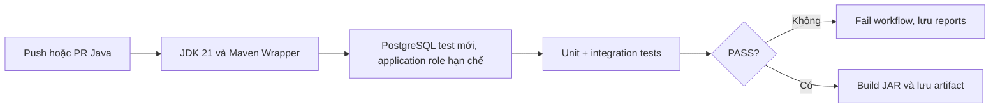
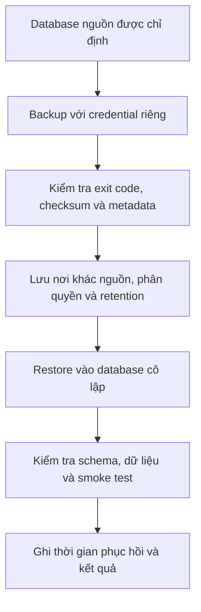

# Bước 4 — Java CI, metrics, backup/restore và deployment

Trạng thái: ĐÃ CÓ NỀN TẢNG, KIỂM THỬ LOCAL. Chưa có GitHub run hay staging deployment
thật. [Nghiệm thu và giới hạn](IMPLEMENTATION-3-4-5.md).

## 1. Mục tiêu phi chức năng

Mỗi thay đổi được kiểm thử tự động; người vận hành phát hiện lỗi, truy vết request,
sao lưu và phục hồi được dữ liệu. Deployment có cấu hình riêng, không làm yếu guard
database local chỉ để Java chạy được trong container.

## 2. CI PostgreSQL tự động

Đề xuất `.github/workflows/java-ci.yml` trigger backend-java và chính workflow.
Giữ URL/role test phù hợp guard hiện có: 127.0.0.1:55433/refurbished_test,
refurbished_test. Tài khoản ứng dụng không được chạy test bằng PostgreSQL superuser.
Credentials CI sinh riêng, không đọc `.env.local` trên máy người dùng.

Dùng Maven verify để chạy cả Surefire/Failsafe; không dùng skipTests hoặc `|| echo`
che lỗi. Reports được upload cả khi fail; artifact không chứa env hoặc log bí mật.
Cache dependency không đồng nghĩa cache dữ liệu database. Không truy cập DB dev/production.

## 3. Metrics và log

Đề xuất Actuator/Micrometer với endpoint được giới hạn mạng/quyền, chỉ expose dữ liệu
cần thiết. Không mở `/actuator/**` public hàng loạt.

| Tín hiệu | Mục đích |
|---|---|
| HTTP count, latency, status | Phát hiện API chậm/lỗi |
| JVM memory, GC, threads | Theo dõi tài nguyên |
| DB pool active/pending | Phát hiện thiếu connection |
| Checkout success/conflict/error | Phân biệt tranh chấp nghiệp vụ với lỗi hệ thống |
| Liveness/readiness | Phân biệt process sống và khả năng phục vụ |

Không gắn serial/email/orderId làm metric label để tránh tăng số chuỗi dữ liệu vô hạn.
Request ID dùng để nối log; kiểm soát độ dài/định dạng nếu nhận từ client.
Không log Authorization/password/token/body nhạy cảm. Audit nghiệp vụ vẫn là dữ liệu
riêng, không thay bằng log HTTP. Ngưỡng cảnh báo/SLO phải được đo và chốt, chưa tự cam kết.

## 4. Backup và restore

Runbook phải nêu đích rõ ràng, role, phiên bản công cụ, mã hóa/lưu secrets và cách
kiểm tra file backup. Không truyền password trực tiếp vào command line. Bản backup
chứa dữ liệu nhạy cảm, không commit Git. Không restore đè DB dev/production trong test.

RPO (mức mất dữ liệu chấp nhận được) và RTO (thời gian phục hồi) chưa chốt. Một file
dump tồn tại chưa chứng minh restore được; chỉ đánh dấu hoàn thành sau restore drill.
Backup secrets cấu hình là quy trình riêng; dump database không chứa mọi cấu hình ứng dụng.

## 5. Deployment riêng cho Java

Đề xuất Dockerfile Java và compose deployment riêng, cấu hình profile rõ ràng. Giữ
LocalDataSourceConfiguration cho dev/test; thiết kế datasource deployment khác với
validation và giới hạn riêng, không đơn giản bỏ mọi kiểm tra URL.

Chuẩn bị HTTPS/reverse proxy, secrets, giới hạn tài nguyên, health checks, network nội
bộ cho DB và lifecycle migration. Image/CI action versions được xác minh tại thời điểm
triển khai. Không dùng production Compose Node cũ cho Java.

Rollback ứng dụng phải xét tương thích schema: không giả định đổi image về bản cũ là
hoàn tác migration. Ưu tiên migration tương thích và chiến lược expand/contract khi cần.

## 6. Thứ tự và nghiệm thu

- [x] CI Java cơ bản có workflow, PostgreSQL test riêng, reports/JAR artifact và browser/Postman acceptance.
- [ ] Có run GitHub Actions thật PASS và kiểm chứng lỗi test làm workflow FAIL.
- [x] Metrics/log/readiness được test; endpoint metrics/prometheus cần ADMIN.
- [ ] Load test đo latency/error/lock timeout; báo số liệu, không tự tuyên bố chịu tải.
- [x] Backup/restore scripts + runbook; restore drill vào container cô lập thành công.
- [ ] Chốt hosting/domain/secrets/RPO/RTO và thiết kế profile deployment.
- [ ] Image khởi động, migration, smoke test và rollback được thử ở staging.
- [ ] Chỉ đánh dấu deployed khi có deployment thật và bằng chứng; không chỉ tạo Dockerfile.

Comment mẫu: “Readiness phụ thuộc DB vì mọi giao dịch cần persistence; liveness
không nên thất bại chỉ vì DB tạm ngắt, tránh vòng lặp restart không giải quyết nguyên nhân.”
