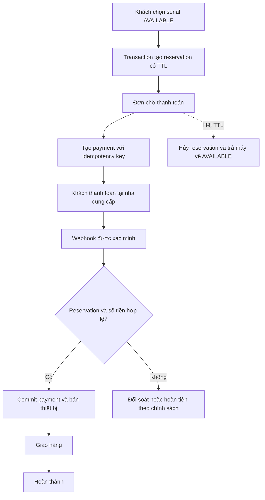

# Bước 5 — Bán online (nền sandbox đã triển khai)

[Review hiện trạng](NEXT-STEPS-REVIEW.md). Reservation TTL, payment/refund sandbox,
shipment thủ công và kiểm thử tranh chấp đã có. Chưa tích hợp provider thật; chỉ bật
tiếp sau khi chốt nhà cung cấp, chính sách và webhook. Không phải điều kiện để hoàn
thành bản quản trị bán hàng tại quầy.

## 1. Vì sao không gắn payment ngay vào checkout hiện tại?

Checkout hiện bán ngay và đơn trở thành COMPLETED trong một transaction. Thanh toán
online là quá trình bất đồng bộ: khách có thể bỏ dở, webhook đến trễ/trùng, tiền đã thu
nhưng ứng dụng chưa nhận phản hồi. RESERVED hiện tại chưa có chủ sở hữu hoặc hạn dùng.

Phải thiết kế vòng đời giữ máy/đơn/thanh toán trước, rồi mới tích hợp cổng thanh toán.

## 2. Quyết định cần chốt

- Khách có tài khoản hay guest checkout? Ai được đọc đơn và dữ liệu giao hàng?
- Giữ máy bao lâu, mỗi khách tối đa bao nhiêu máy, có cho gia hạn không?
- Nhà cung cấp payment, tiền tệ, phương thức, sandbox và quy trình đối soát?
- Khi payment đến sau reservation hết hạn: hoàn tiền hay xử lý thủ công?
- Cho hủy/đổi trả trong điều kiện nào, phí vận chuyển ai chịu, refund toàn phần hay một phần?
- Khi nào bắt đầu bảo hành: bán, thanh toán, giao thành công hay cấp bảo hành?

## 3. Workflow mục tiêu

Tên trạng thái mới là đề xuất, chưa phải enum/schema được chốt. Không giữ transaction
DB mở trong lúc gọi API payment/shipping qua mạng.

## 4. Dữ liệu dự kiến

| Khái niệm | Dữ liệu và ràng buộc cần |
|---|---|
| Reservation | device, owner, expiry, trạng thái; một giữ chỗ hoạt động mỗi máy |
| PaymentAttempt | order, provider reference, amount/currency, trạng thái, idempotency key |
| PaymentEvent | provider event ID unique, trạng thái xử lý, thời điểm |
| Shipment | order, địa chỉ snapshot, tracking, trạng thái |
| Refund | payment, amount, reason, provider reference, trạng thái |
| Return/inspection | máy trả về, điều kiện nhận, kết quả kiểm định trước tái bán |

Model bán lại phải xử lý constraint hiện tại unique(order_items.device_unit_id).
Không bỏ constraint mà chưa có ràng buộc ngăn hai lần bán hoạt động trên cùng máy.
Snapshot địa chỉ/giá giữ lịch sử dù hồ sơ khách hoặc giá hiện tại thay đổi.

## 5. Tư duy giải quyết vấn đề

- Reservation và job hết hạn cùng dùng khóa/điều kiện cập nhật với checkout/payment;
  job không được giải phóng máy đã bán vì đọc trạng thái cũ.
- Webhook xác minh chữ ký theo provider, kiểm tra amount/currency và order nội bộ;
  không tin frontend báo “đã thanh toán”.
- Duplicate/out-of-order webhook được xử lý bằng event ID unique và transition hợp lệ.
- Payment đến trễ không được tự bán máy đã chuyển cho người khác. Chính sách refund/
  reconciliation cần ghi rõ, có trạng thái để người vận hành theo dõi.
- Retry gọi provider phải dùng khóa idempotency phù hợp; DB transaction không thể
  rollback một khoản tiền đã thu ở bên ngoài.
- Refund hoàn tất về tiền không tự đưa máy về AVAILABLE; phải nhận máy và kiểm định.
- Thông báo email và gọi dịch vụ ngoài sau commit, cân nhắc outbox/retry để không mất
  tác vụ; chưa cần Kafka chỉ vì có sự kiện.

## 6. Thứ tự và nghiệm thu

- [ ] Chốt mô hình khách hàng, chính sách và provider thật trước khi bật public online checkout.
- [x] Thiết kế state machine/migration reservation tách khỏi counter sale immutable.
- [x] Reservation/expiration, payment/refund sandbox và shipment thủ công.
- [x] Test hai request giữ cùng serial: tối đa một reservation ACTIVE.
- [x] Test expiry đua payment, event lặp, sai amount, payment đến trễ và quyền sở hữu.
- [x] Test refund không tự trả máy về AVAILABLE hoặc cho tái bán trước khi nhận/kiểm định lại.
- [ ] Webhook chữ ký, provider timeout/restart thực, payment thật và quy trình đối soát.

Comment mẫu: “Không chuyển máy sang AVAILABLE chỉ vì refund thành công: hoàn tiền
không chứng minh cửa hàng đã nhận lại máy và kiểm tra chất lượng.”
