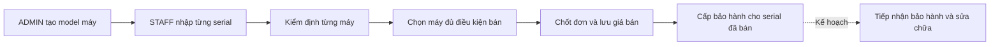
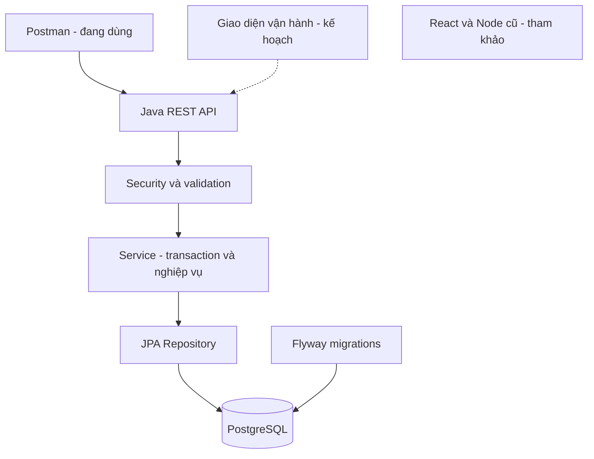

# Bản đồ dự án Refurbished Tech

Bộ tài liệu giúp hình dung hệ thống làm gì, dữ liệu đi đâu và vì sao chọn từng cách xử lý.
Ngày lập: 2026-09-25. Kế hoạch triển khai chính: [PLAN.md](../../PLAN.md).

**Cập nhật:** bước 2 đã có API tra cứu, audit, checkout idempotency và Postman chạy trên DB test.
Xem [hợp đồng và kết quả](../../backend-java/docs/STEP-2-OPERATIONS.md).
Bước 1A đã qua 85 tests và test script local. Các sơ đồ gắn nhãn
ĐANG LÀM bên dưới phản ánh thời điểm lập kế hoạch; trạng thái nghiệm thu mới nhất
nằm trong [hướng dẫn bước 1A](../../backend-java/docs/STEP-1A-ACCOUNTS.md).

## Đọc theo thứ tự

Review và kế hoạch chi tiết cho bốn phần còn lại:
[API vận hành → UI Java → CI/vận hành → bán online](NEXT-STEPS-REVIEW.md).

1. [Workflow và phạm vi sản phẩm](WORKFLOW.md): ai sử dụng, thao tác gì, kết quả mong đợi.
2. [Sơ đồ dữ liệu](DATA-MODEL.md): các bảng hiện có, quan hệ và phần dự kiến thêm.
3. [Logic và tư duy giải quyết vấn đề](BUSINESS-LOGIC.md): quy tắc, transaction, lỗi và lựa chọn thiết kế.
4. [Lộ trình triển khai và kiểm chứng](DELIVERY.md): thứ tự làm, đầu ra và cách xác nhận hoàn thành.

## Ký hiệu trạng thái

| Nhãn | Ý nghĩa |
|---|---|
| HIỆN CÓ | Có mã nguồn trong backend Java; không có nghĩa đã kiểm thử production |
| ĐANG LÀM | Có thay đổi trong working tree, chưa xác minh đầy đủ |
| KẾ HOẠCH | Chưa triển khai; cần hoàn thành theo PLAN.md |
| CẦN CHỐT | Lựa chọn nghiệp vụ cần xác định trước khi viết code |

## Hình dung bằng một ví dụ

Cửa hàng nhận hai MacBook cùng model. Máy serial `MBA001` pin 92%, máy `MBA002` pin 78%.
Chúng dùng chung Product nhưng có hai DeviceUnit, hai kết quả kiểm định và giá bán riêng.
Nhân viên bán `MBA001`; `MBA002` vẫn ở kho. Bảo hành của người mua phải gắn với `MBA001`.

Sản phẩm trước mắt là **hệ thống vận hành nội bộ**, không phải website mua sắm hoàn chỉnh.
Khách hàng hiện là người mua được nhân viên ghi nhận; chưa có vai trò CUSTOMER trong Java.

## Kiến trúc và giới hạn hiện tại

- API Java local: `127.0.0.1:8080`; PostgreSQL dev/test có database và cổng riêng.
- `fe/` hiện phụ thuộc hợp đồng API Node, chưa dùng trực tiếp được các luồng Java này.
- Source có migrations V1–V7; V7 đã kiểm tra trên test, dev chỉ migrate khi chạy bản mới.
- Có cấu hình/log local không đồng nghĩa đã có deployment, monitoring hoặc kiểm thử tải production.

Các sơ đồ Mermaid nằm trong code fence `mermaid`. Có thể xem trên GitHub khi tài liệu
được push, hoặc bằng Markdown preview hỗ trợ Mermaid trong IDE.
