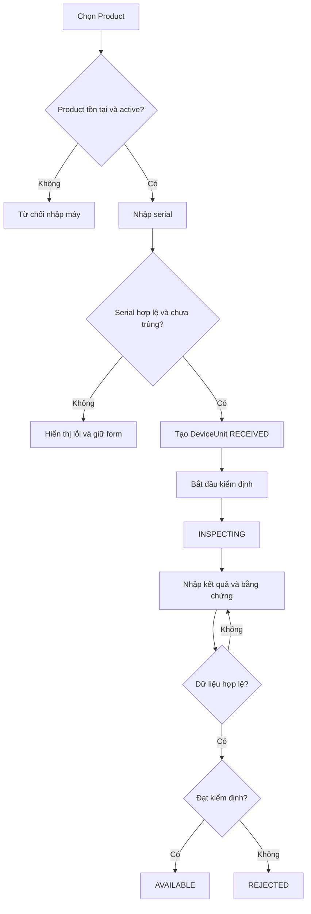
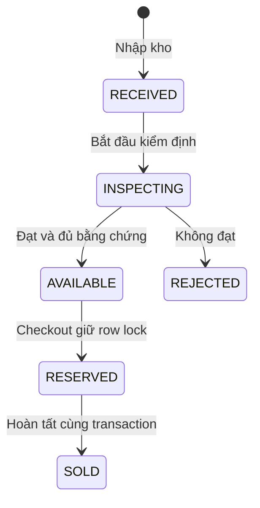
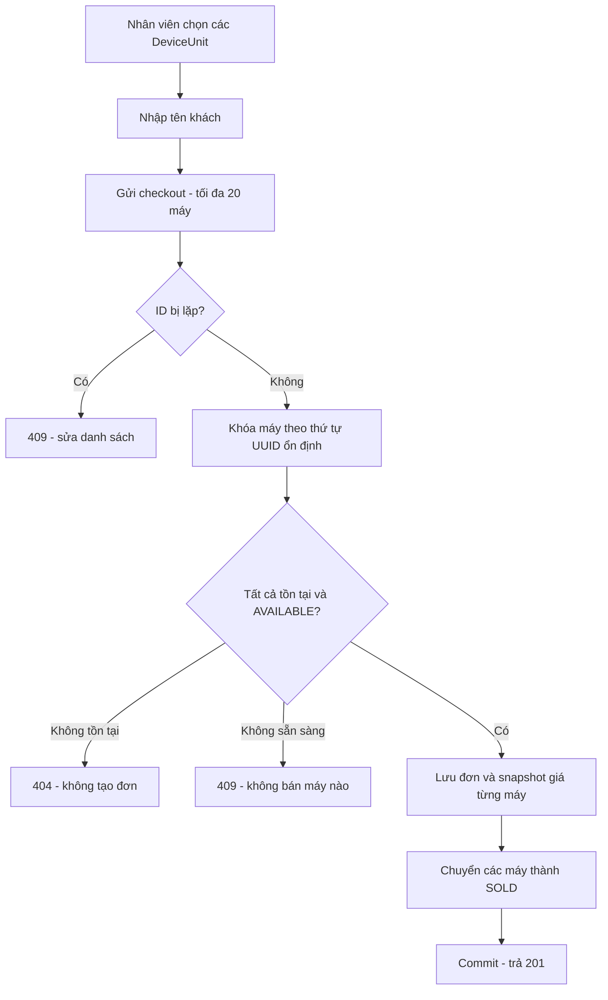
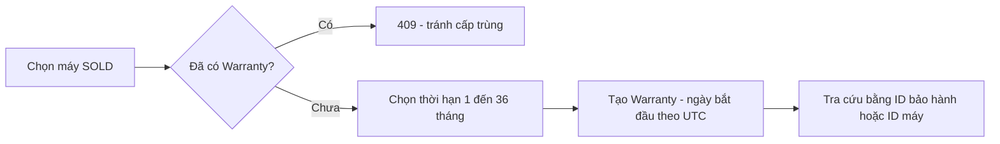
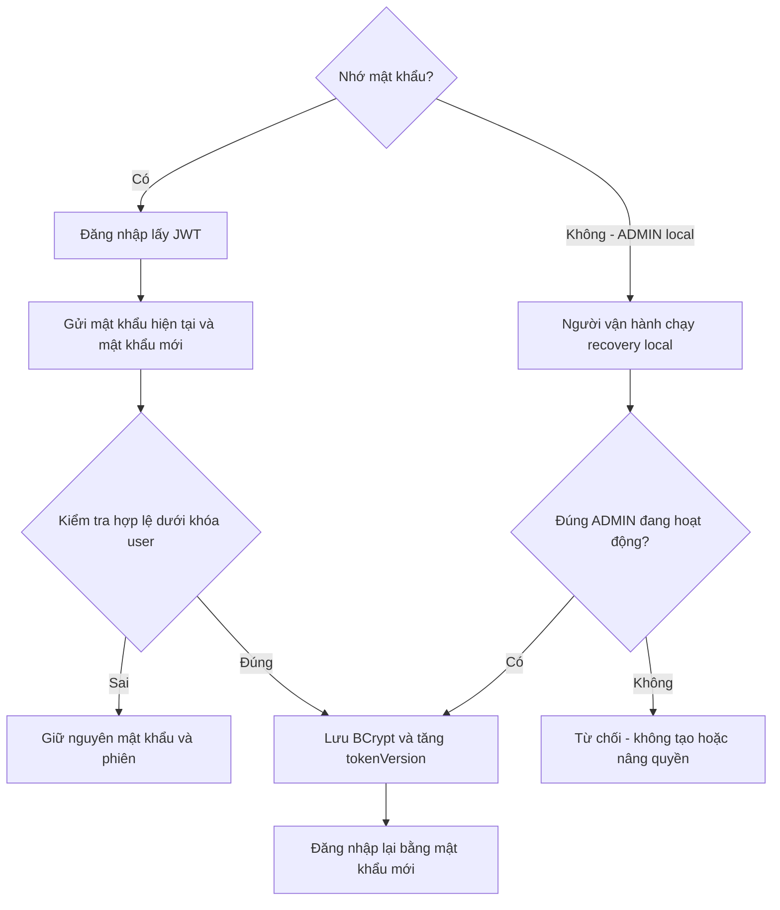

# Workflow nghiệp vụ và trải nghiệm người dùng

[Mục lục](README.md) · [Dữ liệu](DATA-MODEL.md) · [Logic](BUSINESS-LOGIC.md)

## 1. Ai sử dụng?

| Vai trò | HIỆN CÓ | KẾ HOẠCH |
|---|---|---|
| ADMIN | Tạo/sửa Product, tạo user, thao tác kho/bán/bảo hành | Quản lý trạng thái/quyền user, audit, báo cáo |
| STAFF | Nhập máy, kiểm định, checkout, cấp/tra cứu bảo hành | Tìm serial, tra cứu danh sách đơn, xử lý bảo hành |
| Khách chưa đăng nhập | Đọc Product và health API | Không tự cấp quyền nhân viên |
| Người vận hành local | Khởi động Java/database, bootstrap ADMIN | Khôi phục ADMIN có kiểm soát, backup/restore |

Giao diện phải phản ánh các quyền này, nhưng backend mới là nơi quyết định quyền.
Đọc Product inactive ở public là chính sách còn cần chốt: ẩn khỏi khách hay chỉ ngừng nhận máy mới?

## 2. Quy trình nhập và kiểm định máy — HIỆN CÓ ở API

Máy đạt cần grade, giá bán dương, ghi chú và chỉ số pin hoặc lý do không đo được.
Máy không đạt vẫn cần ghi chú; không được âm thầm đưa vào danh sách bán.
HIỆN CÓ chưa có luồng sửa chữa → kiểm định lại cho REJECTED.

## 3. Vòng đời thiết bị — HIỆN CÓ

`RESERVED` hiện chỉ là bước bên trong transaction checkout đồng bộ. Đây chưa phải
giữ chỗ cho khách 10 phút hoặc trạng thái chờ thanh toán online. Transaction lỗi thì
toàn bộ thay đổi của checkout rollback; không tạo một bước “rollback” nghiệp vụ riêng.

## 4. Quy trình bán hàng — HIỆN CÓ ở API

Ví dụ: A chọn máy 1 và máy 2, nhưng máy 2 đã bán. Cả đơn bị từ chối; máy 1 vẫn
AVAILABLE. Không tự bán một phần vì khách/nhân viên chưa đồng ý đơn khác với yêu cầu.

KẾ HOẠCH giao diện: trang chọn máy, màn xác nhận đơn, chi tiết kết quả; gặp 409 thì
tải lại tình trạng và yêu cầu người dùng chọn lại. Không tự retry POST khi mạng lỗi.

## 5. Bảo hành

HIỆN CÓ:

CẦN CHỐT: ngày bắt đầu nên là ngày cấp, ngày bán hay ngày giao máy? Code hiện dùng
ngày cấp; không tự coi đó là chính sách cuối cùng của cửa hàng.

KẾ HOẠCH mở rộng: tiếp nhận yêu cầu → kiểm tra điều kiện → chẩn đoán → báo phương án
→ sửa chữa/đổi máy → bàn giao → đóng yêu cầu. Trạng thái và điều kiện cụ thể chưa chốt.

## 6. Tài khoản và khôi phục — ĐANG LÀM

Không có API public tự đặt lại mật khẩu chỉ bằng email. Quên mật khẩu qua email cần
thiết kế xác minh danh tính, token một lần, hạn dùng và chống lạm dụng riêng.

## 7. Các màn hình dự kiến làm theo thứ tự

1. Đăng nhập, thông tin tài khoản, đổi mật khẩu, đăng xuất tất cả phiên.
2. Product: danh sách, tạo/sửa model, trạng thái hoạt động.
3. Kho: lọc trạng thái, tìm serial, nhập máy, chi tiết máy.
4. Kiểm định: dữ liệu bằng chứng, kết quả và lỗi validation.
5. Bán hàng: chọn máy → xác nhận → kết quả đơn; tra cứu danh sách/chi tiết đơn.
6. Bảo hành: cấp và tra cứu; xử lý yêu cầu ở giai đoạn sau.
7. Quản trị user và lịch sử thao tác theo quyền ADMIN.

Mỗi màn hình cần trạng thái đang tải, chưa có dữ liệu, thành công và lỗi; bản đầu tiên
phải dùng Java API thật, không dùng dữ liệu mẫu để giả lập tính năng đã hoàn tất.
